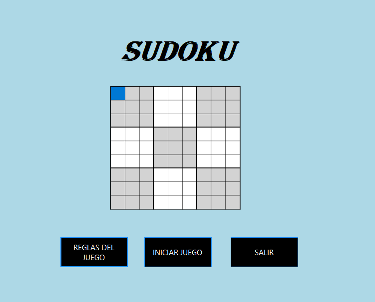
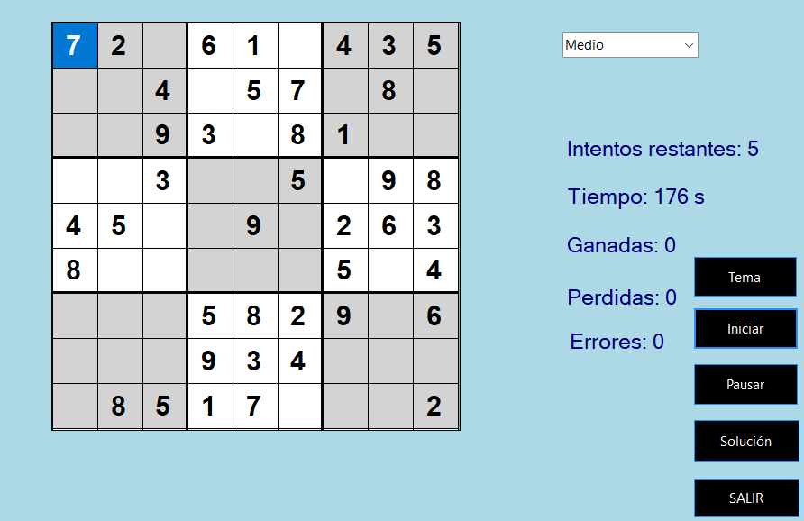
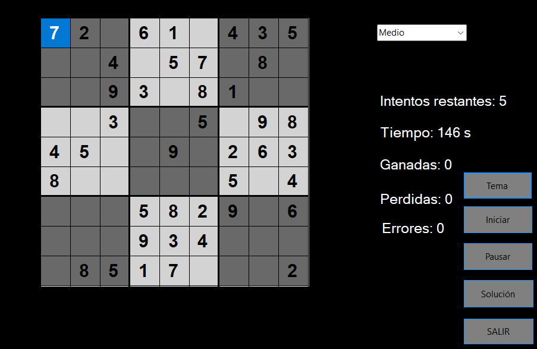
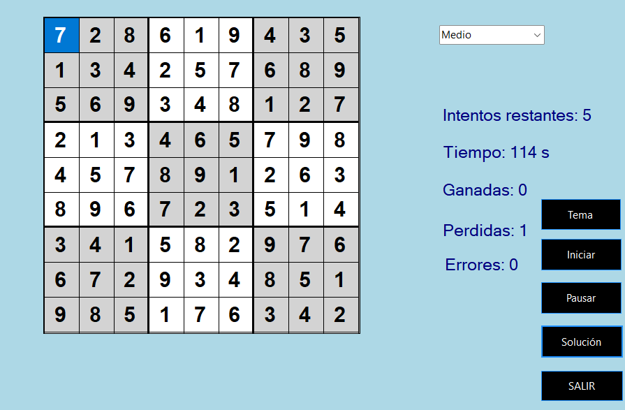
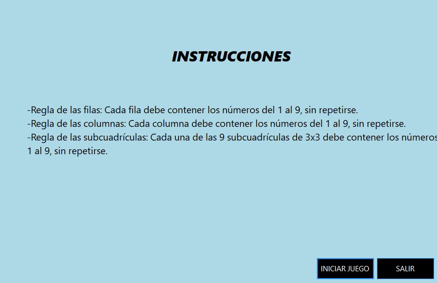

# 🔢 Sudoku

Juego de Sudoku desarrollado con **C#** y **Windows Forms**.

## 📋 Tecnologías utilizadas

- C#
- Windows Forms (.NET)
- Visual Studio

## ✨ Características

- Selector de nivel de dificultad (fácil, medio, difícil)
- Tablero interactivo de 9x9 con las 9 subcuadrículas de 3x3
- Tema claro y tema oscuro
- Contador de intentos restantes
- Temporizador de partida
- Contador de partidas ganadas, perdidas y errores
- Botón de solución automática
- Pantalla de instrucciones con las reglas del juego

## 📸 Capturas del juego

### Pantalla de inicio


### Partida en curso (tema claro)


### Partida en curso (tema oscuro)


### Tablero resuelto


### Instrucciones


## 🚀 Cómo ejecutar el proyecto

1. Clonar el repositorio
   ```
   git clone https://github.com/cvanessa-dev/juego-sudoku.git
   cd juego-sudoku
   ```
2. Abrir el archivo `.sln` con Visual Studio
3. Restaurar los paquetes NuGet si Visual Studio lo pide
4. Compilar el proyecto (Ctrl+Shift+B)
5. Ejecutar (F5)

## 📁 Estructura del proyecto

    juego-sudoku/
    ├── Properties/
    ├── Resources/           # Imágenes y recursos del juego
    ├── FormJuego.cs         # Lógica principal del tablero
    ├── SUDUKO.cs            # Pantalla de inicio
    ├── FormReglas.cs        # Pantalla de instrucciones
    ├── Program.cs
    └── App.config

## 👩‍💻 Autora

Vanessa Rodriguez -
Estructura de Datos -
Ingenieria en Sistemas
